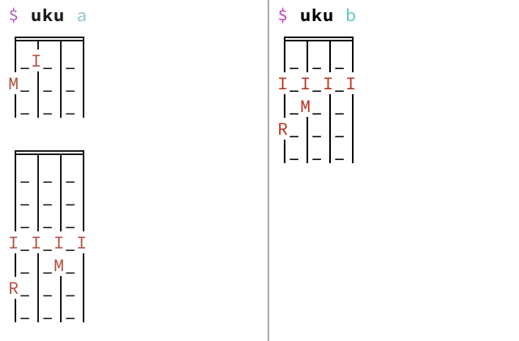

# Uku

Display ukulele fingering charts in your terminal.

Read the release announcement at
[adriansieber.com/ukulele-fingering-chart-cli-tool-in-haskell](
  https://adriansieber.com/ukulele-fingering-chart-cli-tool-in-haskell)
for more information.

## Installation

### From Source

1. Clone repository: `git clone`
1. `cd uku`
1. Build and install: `stack install`
